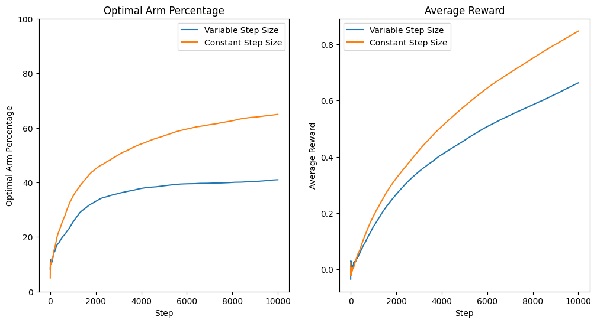
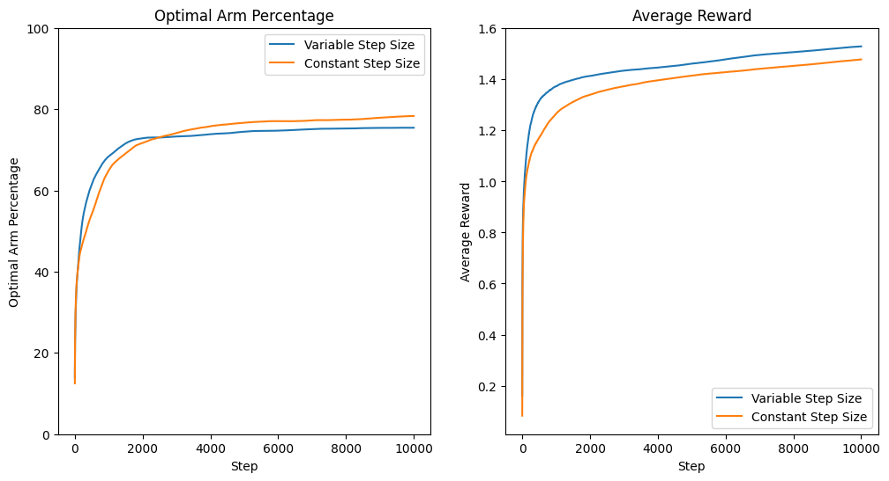

# Project 1
## Non-Stationary Multi-Armed Bandit Problem

- Name: Tanay Nistala
- Date: 2023-09-26

---

## Part 1: Sample-Average vs. Constant Step-Size

The sample-average method is a powerful method for the multi-armed bandit problem, allowing an agent to empirically gain a good approximation of the bandit model and find the optimal action. However, in non-stationary problems its effectiveness is less clear as the optimal action changes over time, and the sample-average method may take some time to identify the new optimal actions. To counter this, the idea of a constant step size method is introduced, allowing the agent to weight more recent actions and rewards more heavily than older ones, potentially allowing the agent to identify the new optimal action more quickly.

### Algorithm

The bandit algorithm used in this experiment will use two methods: the sample-average method, which weights all rewards equally, and the constant step size method, which weights more recent rewards more heavily. The sample-average method is defined as follows:

$$
Q(a)_{n+1} = Q(a)_n + \frac{1}{n}(R(a)_n - Q(a)_n)
$$

The constant step-size method is defined as follows:

$$
Q(a)_{n+1} = Q(a)_n + \alpha(R(a)_n - Q(a)_n)
$$

where $\alpha$ is the step size, set to 0.1 in this experiment. 

### Experiment

The experiment is set up using two testbeds of 10 arms each, with 200 runs of 10,000 steps each. The true value for each arm is initialized at 0, and on every step the true value for each arm is incremented randomly by a small amount (determined by a normal distribution with mean 0 and standard deviation 0.01). The reward on each step is generated by a normal distribution with mean equal to the arm's true value and a standard deviation of 1. Each testbed handles one of the two methods being investigated.

The agents use an $\epsilon$-greedy policy with $\epsilon = 0.1$ to choose which arm to pull. Agents using the sample-average method are passed an $\alpha$ value of 0 (converted internally to $\frac{1}{n}$), and agents using the constant step size method are passed an $\alpha$ value of 0.1. 

Sample code for running the experiment is shown below:

```python
envs   = [ Environment(NUM_ARMS, mode=0) for _ in range(NUM_TESTS) ]
agents = [ Agent(NUM_ARMS, e=0.1, a=0)   for _ in range(NUM_TESTS) ]

stats_var_step = run_simulation(envs, agents, update_mode=2)
show_stats(stats_var_step)
```

### Results

The results of the experiment are shown below. The first graph below shows the percentage of times the agents chose the optimal action (averaged over 200 testbeds), and the second graph shows the average reward received by the agents for each method.



As is evident, the constant step size method outperforms the sample-average method in both metrics. The constant step size method consistently identified the optimal arm 65% of the time after 10,000 steps, and received over 30% higher rewards than the sample-average method. The sample-average method, on the other hand, identified the optimal arm less than 40% of the time after 10,000 steps. Clearly, the ability of the constant step size method to produce a better picture of the environment's *current* true values allows it to outperform the sample-average method in non-stationary problems.

## Part 2: Best-Arm Random Walk

In continuation of the previous experiment, this part will investigate the performance of the sample-average and constant step size methods on a less volatile environment where the true values of the arms do not change as rapidly or as often. In particular, this experiment will use testbeds where at each step only the optimal arm's true value is incremented, while the other arms remain unchanged. 

The motivation behind this experiment is that while the constant step size method clearly outperformed the sample-average method on an all-arms random walk environment, the best-arm random walk may be a middle ground where the sample-average method can still perform on par with, or better than, the constant step size method.

### Algorithm

The algorithm used in [Part 1](#part-1-sample-average-vs-constant-step-size) is modified here to only increment the true value of the optimal arm on each step, as shown in the code excerpt below:

```python
if mode == 1:
    # Random walk (best arm only)
    best_arm = np.argmax(self.means)
    self.means[best_arm] += random.normal(0, 0.01)
elif mode == 2:
    # Random walk (all arms)
    for i in range(self.num_arms):
        self.means[i] += random.normal(0, 0.01)
```

The algorithm for the agents remains the same as before.

### Experiment

The testbeds are set up in the same way as Part 1, except that the environments are now initialized with true values generated from a normal distribution with mean 0 and unit variance. Best-arm random walks are carried out by passing an `update_mode` of 1 to each of the environments' updaters in the simulation loop. 

The sample-average agents are again passed an $\alpha$ value of 0 to trigger the decreasing step size, and the constant step size agents are passed an $\alpha$ value of 0.1 to maintain comparability with the previous experiment.

Sample code for running the experiment is shown below:

```python
envs   = [ Environment(NUM_ARMS, mode=1) for _ in range(NUM_TESTS) ]
agents = [ Agent(NUM_ARMS, e=0.1, a=0)   for _ in range(NUM_TESTS) ]

stats_var_step_sing = run_simulation(envs, agents, update_mode=1)
show_stats(stats_var_step_sing)
```

### Results

The results of the experiment are shown below. The first graph below shows the percentage of times the agents chose the optimal action (averaged over 200 testbeds), and the second graph shows the average reward received by the agents for each method.



As seen above, both methods perform somewhat similarly, with the sample-average method performing slightly better early on, while the constant step size method overtakes the former in terms of percentage of optimal arm pulls after around 2,000 steps. Their performance is very close though, with the sample-average method pulling the optimal arm 75% of the time, with the constant step size method at 78%. 

The average reward received by the agents is also very close, with the sample-average method receiving an average reward of 1.53, and the constant step size method receiving an average reward of 1.48. On this metric the sample-average method performs slightly better, but the difference is minor and it is plausible that the constant step size method may perform better on even longer runs as it is able to pull the optimal arm slightly more often.

Either way, the results of this experiment show that the best-arm random walk environment does indeed allow the sample-average method to perform on par with the constant step size method, and in terms of the average reward even better. This is likely due to the fact that the best-arm random walk environment is less volatile than the all-arms random walk environment, and thus the sample-average method is able to keep up with the changes in the environment's true values.

## Summary and Conclusion

The results of these experiments show that the constant step size method generally outperforms the sample-average method on non-stationary problems, but that the sample-average method can perform on par with the constant step size method in some less volatile environments, like the best-arm random walk. While the results were clear in the all-arms random walk environment, the results in the best-arm random walk environment are fairly close, and it is possible that the precise performance of the two methods may vary depending on the environment.

### Future Exploration

It remains to be seen how the exact variance of the random walk affects the performance of the two methods. In this experiment, the variance was set to 0.01, but it is possible that a higher variance may introduce higher volatility that allow the constant step size method to perform better, and would need to be investigated further.

Additionally, the effect of the step size parameter $\alpha$ on the performance of the constant step size method could be investigated. In this experiment, $\alpha$ was set to 0.1, but higher values will allow the agent to further prioritize more recent results, and could potentially improve its performance in more volatile environments where recent results are more important.