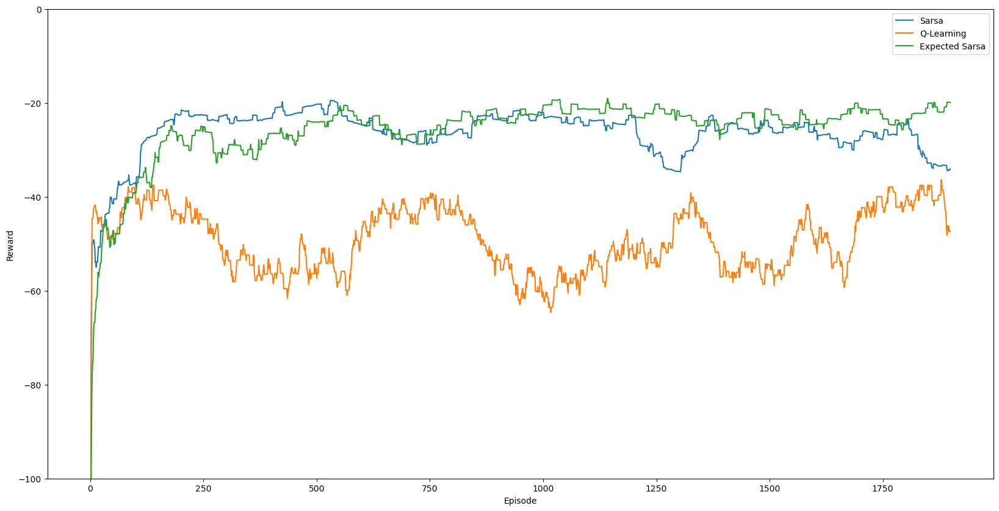
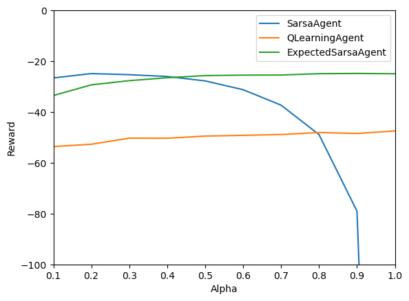
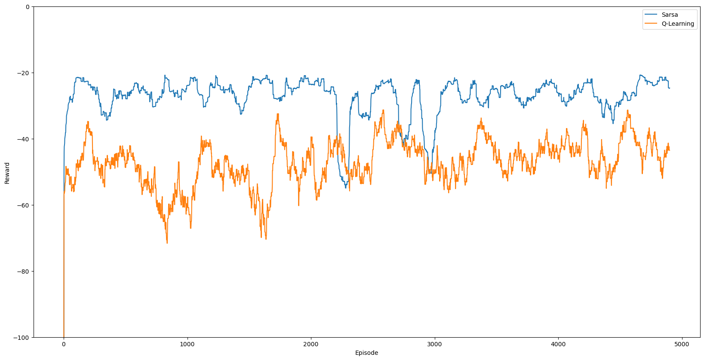

# Project 3
## Cliff Walking and Temporal Difference Learning

- Name: Tanay Nistala
- Date: 2023-11-13

---

## Part 1: Cliff Walking

The Cliff Walking problem is an example of Temporal Difference (TD) learning methods, where an agent must learn to navigate a gridworld with a cliff representing an obstacle at the bottom of the grid. Specifically, it demonstrates the ability of various TD algorithms to learn policies for avoiding obstacles, with various degrees of risk aversion.

### Algorithm

In this experiment, three of the primary TD algorithms will be tested on the Cliff Walking problem: SARSA, Q-Learning, and Expected SARSA. The performance of each algorithm will be compared in terms of the total reward received by the agent over the course of the simulation.

These algorithms differ in their update rules, which are shown below:

#### SARSA

$$Q(S_t, A_t) \leftarrow Q(S_t, A_t) + \alpha [R_{t+1} + \gamma Q(S_{t+1}, A_{t+1}) - Q(S_t, A_t)]$$

#### Q-Learning

$$Q(S_t, A_t) \leftarrow Q(S_t, A_t) + \alpha [R_{t+1} + \gamma \max_a Q(S_{t+1}, a) - Q(S_t, A_t)]$$

#### Expected SARSA

$$Q(S_t, A_t) \leftarrow Q(S_t, A_t) + \alpha [R_{t+1} + \gamma \sum_a \pi(a|S_{t+1}) Q(S_{t+1}, a) - Q(S_t, A_t)]$$

### Experiment

The experiment is set up using an environment simulating a small gridworld with a cliff at the bottom, illustrated below, where medium gray denotes the cliff, black denotes the top of the cliff, and white is the goal state.

The agent starts at the bottom left corner of the grid, and must navigate to the bottom right corner while avoiding the cliff by going around it. The agent receives a reward of -1 for each step taken to incentivize it to find the shortest path, and a reward of -100 is given for falling off the cliff. Falling off the cliff also resets the agent to its starting location. The agent receives a reward of 0 (effectively -1 due to the step penalty) for reaching the bottom right corner, where the episode terminates.

The agents use an $\epsilon$-greedy policy with $\epsilon = 0.1$ to choose which direction to move (N, S, E, W). The agents' $\alpha$ values are set to 0.5, and the discount factor $\gamma$ is set to 1. The agents' Q-tables are initialized to 0, and the agents are run for 2000 episodes.

### Results

The results of the experiment are shown below. Each line shows the total reward received over an episode, with 2000 episodes run. The results use a running average over 10 episodes to smooth out the graph.

As is evident, Q-Learning generally results in the lowest reward of the three, with the average hovering between -40 to -60. This is likely due to the fact that Q-Learning is a greedier algorithm, and thus the agent tends to learn a riskier path along the edge of the cliff where the $\epsilon$-greedy policy can occasionally make it "jump off" the cliff. In contrast, SARSA methods are more conservative, and the agent tends to find a path as far away from the cliff as possible.

SARSA and Expected SARSA both perform similarly, with SARSA performing slightly better initially, and Expected SARSA performing slightly worse. However, past about 1000 episodes there is a crossover point, and Expected SARSA begins to perform better than its regular counterpart with an average reward of about -20 compared to standard SARSA's -35. In general, Expected SARSA appears to be more consistent, with fewer fluctuations in its performance over episodes in the later stage of the simulation.

However, the small difference in performance between SARSA and Expected SARSA is widened with higher learning rates, as shown in the graph below:

Here, the learning rate was varied for the three agents, and the hybrid algorithm formed by Expected SARSA clearly yields benefits at higher learning rates as it consistently outperforms Q-Learning, while avoiding the sharp drop-off in performance of SARSA at higher learning rates.

## Part 2: Incentivizing Risk for SARSA

In continuation of the previous experiment, this part will investigate whether SARSA agents can be incentivized to formulate riskier policies, comparing them to Q-Learning agents. The motivation behind this experiment is that while SARSA generally produces conservative policies that prioritizes minimizing the chances of hitting an obstacle over finding the optimal or fastest path.

It is expected that providing a high-risk/high-reward scenario such as rewards for staying near the cliff's edge may help the agents learn a riskier policy. The algorithms used remain the same, with the environment modified to allow for rewards for staying near the cliff's edge (shown in light gray below).

### Experiment

The experiment is run using the SARSA agent and compared to a Q-Learning agent on the same task. The environment is modified to provide a reward of 100 for each step taken within 1 square of the cliff, and a reward of -100 for falling off the cliff. Positive rewards are provided only once per square to discourage looping between squares. The agents are run for 5000 episodes, with the same parameters as the previous experiment.

### Results

The results of the experiment are shown below. Each line shows the total reward received over an episode, with 5000 episodes run. The results use a running average over 10 episodes to smooth out the graph.

Here, the SARSA agent once again receives higher rewards than the Q-learning agent, suggesting that the incentive was insufficient to encourage the agent to take more risks. Occasionally, the SARSA agent does take a riskier path, but it is not consistent enough to represent a meaningful difference in its overall behavior.

Inspecting the path generated, the SARSA agent generates the original path almost exactly, with the exception of it taking a riskier path at the very end. This suggests that the agent is not learning a riskier policy, but rather that it is taking a riskier path when it is already close to the goal, and thus the risk is less significant.

Additionally, that it only collects the final reward before the goal suggests that it only takes the risk if it does not meaningfully change the overall path followed. While collecting all the rewards would require it to have high risks all through the episode, collecting rewards only at the beginning and end means it collects the rewards while en route to its "safe" path far from the cliff.

## Summary and Conclusion

The results of the experiments show that SARSA agents are generally more conservative than Q-Learning agents, and that Expected SARSA improves upon both of the aforementioned algorithms by blending the high performance of SARSA at low learning rates with the consistent performance of Q-Learning across various learning rates. Additionally, the results show that SARSA agents are not incentivized to take risks, even when provided with a high-risk/high-reward scenario.