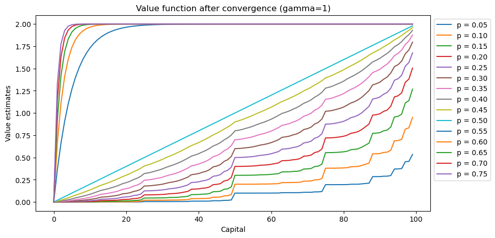
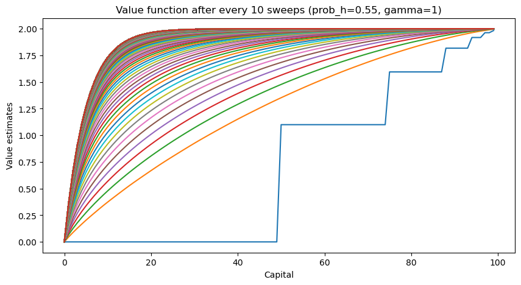
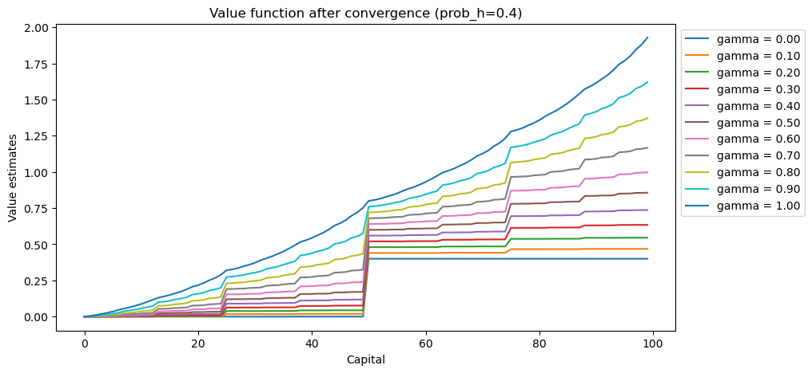
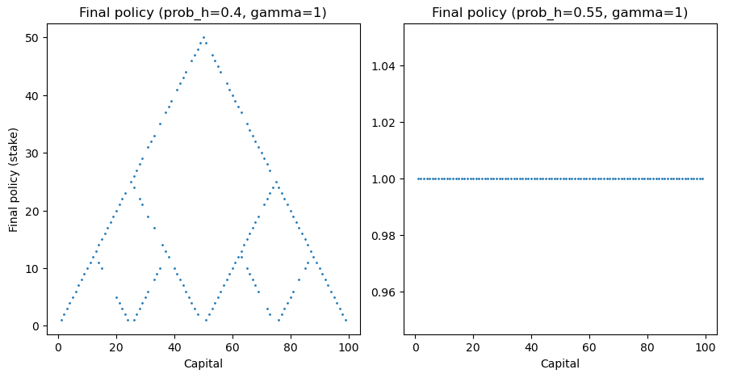
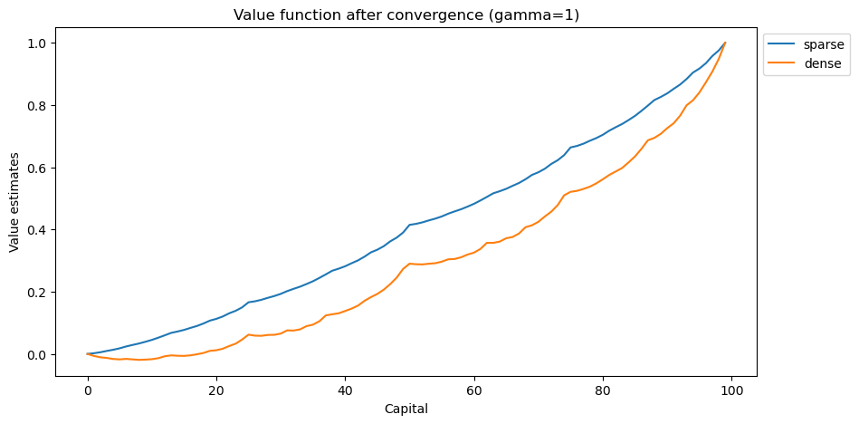
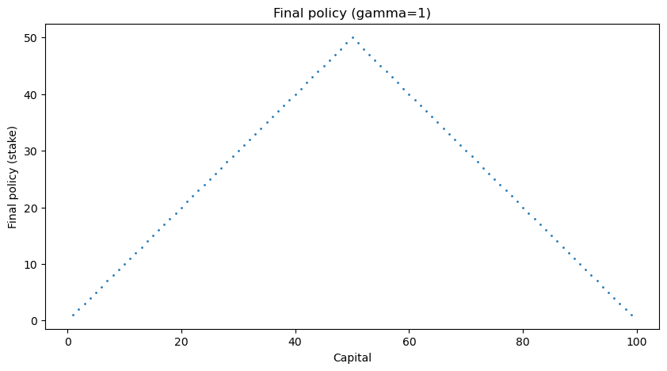

# Project 2
## Gambler's Problem

- Name: Tanay Nistala
- Date: 2023-10-20

---

## Part 1: Standard Gambler's Problem

The value iteration algorithm is a dynamic programming algorithm that can be used to find the optimal policy for a Markov decision process. The algorithm is defined as updates of the value function as follows:

$$
V(s) = \max_a \sum_{s',r} p(s',r|s,a)[r + \gamma V(s')]
$$

where $p(s',r|s,a)$ is the probability of transitioning to state $s'$ and receiving reward $r$ when taking action $a$ in state $s$, and $\gamma$ is the discount factor. The algorithm is initialized with $V(s) = 0$ for all states $s$, except the target state of capital $100$ which has a value of $1$, and iteratively updates $V(s)$ until it converges to the optimal value function $V^*(s)$.

The algorithm explores every possible state, which in this problem is every possible capital value from 1 to 99 inclusive (since 0 and 100 are terminal states), and for each capital state $s$ it then explores every possible action, which is every possible bet from 1 to $\min(s, 100-s)$ inclusive. Each state-action pair is then updated according to the value iteration algorithm, taking into account the reward received when the capital surpasses the target (100). The algorithm is run until the maximum change in value function is less than a threshold $\theta << 1$.

In this experiment, the value iteration algorithm was run with a discount factor of $\gamma = 1$, while the threshold was set to $10^{-15}$. The probability of the coin landing on heads was varied from 0.05 to 0.75 in increments of 0.05, and the number of iterations required for the algorithm to converge was recorded.

### Results

The number of iterations required for the algorithm to converge for each probability is shown in the table below.

| p     | 0.05 | 0.10 | 0.15 | 0.20 | 0.25 | 0.30 | 0.35 | 0.40 | 0.45 | 0.50 | 0.55 | 0.60 | 0.65 | 0.70 | 0.75 |
| ----- | ---- | ---- | ---- | ---- | ---- | ---- | ---- | ---- | ---- | ---- | ---- | ---- | ---- | ---- | ---- |
| iter  | 13   | 16   | 19   | 21   | 23   | 24   | 26   | 27   | 28   | 17   | 2936 | 935  | 471  | 283  | 188  |

The value estimates were also extracted for each probability, and the results are shown in the figure below.

As seen above, as the probability of heads increases from zero the agent develops a higher and higher value function over the state space, corresponding to the agent becoming more optimistic in its estimated return for each state. In general, the higher the agent's capital, the more likely it is to have a higher value for the state, and thus it is more likely to stake a higher amount.

However, past a probability of 0.5 (i.e. a fair coin), theoretically the odds turn in the agent's favor, and its value function shoots up for every state as it becomes almost guaranteed to win on paper. These results generally correspond with probability theory, which helps confirm the accuracy and validity of the algorithm.

Comparing this data to the number of iterations required for convergence, an interesting result is that for probabilities below 0.5, the number of iterations required for convergence generally increases as the probability increases. This is likely due to the fact that the agent is more likely to lose, and it takes longer for the value function to converge to the optimal value function since a majority of the scenarios seen by the algorithm involve it losing bets and straying further from the goal.

However, for probabilities above 0.5, the number of iterations required for convergence sharply increased before decreasing as the probability increased. The sharp spike up can likely be attributed to the fact that the agent is likely to reach its target from most of the capital states, but the relatively small edge over 50% heads means the algorithm takes time to converge the value estimates for all capital states above the threshold where it determines a (near-) guaranteed win. As the probability of landing heads increases even further however, the algorithm converges faster as the chances of winning increase. The slow convergence for $p = 0.55$ is better illustrated in the figure below, which shows the value function at every 10th sweep of the algorithm.

As seen above, the algorithm quickly moves towards the optimal value function but spends a lot of time converging slowly to the final value function. This highlights a downside of the value iteration algorithm in that convergence can take a long time in certain scenarios, even with a suitable stopping threshold.

In addition, the effect of $\gamma$, the discount factor, was also investigated. The algorithm was run with the probability of heads set to 0.4, and with varying $\gamma$ values from $0$ to $1$, and the final value estimates were recorded and plotted in the figure below.

As expected, increasing the discount factor allows the value estimates to converge faster towards their true values. In general, however, it is clear that $\gamma = 1$ is the most effective discount factor, as lower values of $\gamma$ converge at lower value estimates.

Additionally, the policies derived from the value iteration algorithm are presented below. All probabilities below 0.5 resultsed in a pyramid-like policy function, although interestingly the algorithm develops multiple optimal stakes for certain capital states, likely as a result of the algorithm finding certain local maxima for the value function. All policies with a probability of 0.5 or higher resulted in a policy function that was a straight line, as the agent is guaranteed to win from any capital state.

## Part 2: Gambler's Problem with Dense Rewards

In this section, we investigate the effect of a denser reward system on the effectiveness of the value iteration algorithm. The algorithm was run with the same parameters as in Part 1, except that rewards were given based on the outcome of a bet, rather than only when the agent reaches the target capital. The rewards were defined as follows:

- If the agent wins the bet, it receives a reward of 1
- If the agent loses the bet, it receives a reward of -1
- If the agent reaches the target capital, it receives a reward of 100

The idea was to get the algorithm to converge faster, as the agent would receive rewards more frequently and thus would be able to learn faster, rather than having to wait for the agent to reach the target capital. The algorithm used in Part 1 was modified to take into account the new reward system, and the results are shown below.

### Results

The number of iterations required for the modified algorithm to converge was 42 steps, as opposed to the original algorithm's 27. However, it converged to a lower value function, as shown in the figure below.

This is likely due to the fact that the agent now receives negative rewards on failed bets, which drove the value estimates down on the aggregate. However, the agent interestingly became greedier, as the policy it generated clearly sets the higher stakes for all capital states, as opposed to the original algorithm which provided multiple optimal stakes for certain capital states. This can be attributed to the agent receiving higher rewards for higher stakes, thereby incentivizing it to bet higher amounts.

In general, when compared to the original policy, the policy generated by the dense reward algorithm no longer suggests a lower stake for a capital state when a higher stake is equally optimal. This could be useful in getting agents to work towards a goal faster, as they are incentivized to bet higher amounts and thus reach the target capital faster, at the cost of a higher risk.